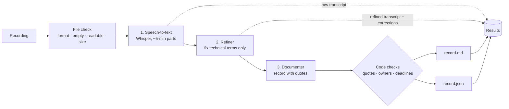

# AI Meeting Assistant

Upload an English meeting recording and get back three things: the **raw transcript** (with who spoke each line), a **refined transcript** with misheard technical terms corrected and speakers named where the recording makes it clear, and a **structured meeting record** (summary, minutes by topic, key decisions, action items, and open proposals/questions) in both **Markdown and JSON**. Built with a FastAPI backend and a React + Vite + TypeScript frontend as a solo submission for the Inter IIT Tech Meet bootcamp ML problem statement.

The record is designed to be trustworthy: every decision, action item and open item is backed by an exact quote from the transcript, and code (not just the prompt) removes anything the model can't back up. Owners and deadlines that weren't said out loud are shown as **Unspecified**, never guessed.



---

## Contents
- [What you get](#what-you-get)
- [Quick start](#quick-start)
- [How it works](#how-it-works)
- [How the problem statement's rules are enforced](#how-the-problem-statements-rules-are-enforced)
- [Configuration](#configuration)
- [Long recordings and Groq's free tier](#long-recordings-and-groqs-free-tier)
- [Testing](#testing)
- [Samples](#samples)
- [Project structure](#project-structure)
- [Known limitations](#known-limitations)

More detail on design decisions, measurements and evaluation: **[docs/DESIGN.md](docs/DESIGN.md)**.

---

## What you get

| Output | Description |
|---|---|
| **Raw transcript** | Whisper's output with timestamps, each line labelled by voice: **Speaker 1**, **Speaker 2**… |
| **Refined transcript** | Same segments and timestamps, with misrecognised technical terms fixed (`CICD → CI/CD`, `open telemetry → OpenTelemetry`) and speakers given **real names where the recording proves them** (someone introduces themselves, or is addressed by name and answers). Others keep their label rather than a guess. Corrections are highlighted; hover to see what Whisper heard |
| **Meeting record** | Summary · minutes by topic · key decisions · action items (task, owner, deadline) · open proposals and questions. Every item shows its timestamp and supporting quote |
| **Downloads** | `record.md`, `record.json`, `refined-transcript.txt`, `raw-transcript.txt`. The Markdown and JSON are generated from the same data |

**The interface** (designed page by page as mockups first: bright, simple and playful):
- **Upload:** a big drop zone with a swaying sound-bar mascot, optional "words we should know", and one-click sample meetings.
- **Processing:** the current step in plain words ("Fixing the jargon…"), step pills, part-by-part progress, retry notes, and a **live fix-it card**: as soon as the refiner finishes, each misheard word is struck through and the right term pops in, while the record is still being written.
- **Results:** an **audio player** with the recording's real waveform. Click any to-do, quote or transcript line to hear that moment, and the transcript highlights the line being played (karaoke style). It also has quick stats, to-do cards with owner and deadline chips ("Needs an owner" instead of a guess), and the transcript as chat bubbles per speaker with fixes highlighted.
- All motion respects the system's "reduce motion" setting. Errors always say which stage failed, what happened and what to do.

## Quick start

### 1. Prerequisites
- **Python 3.12** and **ffmpeg** (used to check, convert and split audio)
- **Node.js 20.19+** (22 or newer recommended)
- A **Groq API key**: free at <https://console.groq.com/keys>

On macOS with Homebrew:
```bash
brew install python@3.12 ffmpeg node
```
On Linux/Windows, install the same three tools with your package manager; everything else is cross-platform.

### 2. Backend
```bash
cd backend
python3.12 -m venv .venv
.venv/bin/pip install -r requirements.txt
cp .env.example .env
```
Optional, for speaker labels and names (installs PyTorch + SpeechBrain, ~300 MB; the voice model, ~90 MB, downloads once on first use):
```bash
.venv/bin/pip install -r requirements-speakers.txt
```
Without it everything still works; transcripts just have no speaker labels.

Open `backend/.env` and replace the three `your-groq-api-key-here` values with your Groq key. Then start the server:
```bash
.venv/bin/uvicorn app.main:app --reload
```
Check it at <http://localhost:8000/health>. It shows the configured models, never the key. Interactive API docs are at <http://localhost:8000/docs>.

> Windows: use `.venv\Scripts\pip` and `.venv\Scripts\uvicorn` instead of `.venv/bin/...`.

### 3. Frontend (in a second terminal)
```bash
cd frontend
npm install
npm run dev
```
Open <http://localhost:5173>, drop in a recording (or click one of the **"Try one of ours"** samples) (`.mp3 .wav .m4a .flac .ogg .webm .mp4 .mpeg .mpga`, up to 200 MB / 120 minutes), optionally list terms used in the meeting (e.g. `Zephyr, KubeFlow`), and click **Process recording**.

A short meeting takes about 10–15 seconds. Try one of the [samples](#samples) first.

### Command-line alternative
Run the whole pipeline without the web app. Outputs go to `scratch/output/<name>/`:
```bash
cd backend
.venv/bin/python scripts/run_pipeline.py ../samples/hard_meeting/recording.mp3
```

## How it works

Three distinct stages, always in this order. Each has its own model setting and prompt file.

| Stage | What it does | Default model (Groq) |
|---|---|---|
| **1. Speech-to-text** | Checks the file (format, empty, unreadable, size, duration), converts it to 16 kHz mono Opus, splits long recordings into ~5-minute parts at pauses in speech, transcribes each part with timestamps, then **labels who is speaking** by comparing voices (SpeechBrain ECAPA, runs locally) | `whisper-large-v3` + `spkrec-ecapa-voxceleb` |
| **2. Refiner** | Fixes misrecognised technical terms, acronyms and product names **only**. The model returns just the segments it changed; code then rejects any edit that changes a number, negation, commitment word, punctuation, duplicates a word split across segments, or rewrites too much. Then **names speakers** where the transcript proves it; code checks every name's evidence | `openai/gpt-oss-120b` |
| **3. Documenter** | Produces the structured record with strict JSON-schema output. Every item must quote the transcript; code verifies quotes, owners and deadlines. Long meetings are documented in parts, joined by code, and cross-checked | `openai/gpt-oss-120b` |

All providers are called through the **OpenAI Python SDK** using `base_url`, so any OpenAI-compatible service works by changing `backend/.env`. Prompts live in [`backend/app/prompts/`](backend/app/prompts/).

**API** (used by the frontend):

| Endpoint | Purpose |
|---|---|
| `POST /api/meetings` | Upload (`file`, optional `glossary`). Bad files are rejected immediately with a specific message; good ones return `202` with a `job_id` |
| `GET /api/meetings/{job_id}` | Progress of each stage, the refiner's corrections as soon as they exist (`preview`), then the full result: transcripts, corrections, record JSON, Markdown, models used, timings |
| `GET /api/samples`, `GET /api/samples/{id}/audio` | The sample meetings offered on the upload page |
| `GET /health` | Server status and configured models |

Errors always have the same shape: `{"error": {"stage", "message", "fix"}}`.

## How the problem statement's rules are enforced

| Rule | How it's enforced |
|---|---|
| **Never invent a task owner or deadline** | The prompt says so, **and** code checks every owner is a name stated in or just before the quoted lines, and every deadline appears word for word there. Otherwise it's set to `null` → shown as **Unspecified**, with a note. "I'll do it" / "we will" / "someone" always become Unspecified (there are no speaker labels, so "I" is unknown) |
| **A proposal is not a decision; an unaccepted suggestion is not a task** | Explicit classification rules in [`documenter.md`](backend/app/prompts/documenter.md), including "postponing is not deciding". For long meetings, a cross-check turns a proposal that's **accepted later** into a decision and keeps only the **final** outcome of a reversed decision. Code validates each such change |
| **Speaker names are never guessed** | A label becomes a name only if code confirms the evidence: the quote is in the transcript and is either the speaker's own introduction ("this is Tom…") or another person saying the name *to someone* ("Neha, can you…?") with that speaker answering next. A name that's merely mentioned ("Rahul said…") proves nothing. Otherwise the line keeps "Speaker N" |
| **Refiner preserves names, numbers, negation and commitments** | Code compares every edit with the original: numbers (with "five" = "5"), negation words (incl. "haven't"), commitment words (will, should, might, decided…), sentence punctuation, and overall similarity. Failing edits are discarded and listed as warnings |
| **No hardcoded or prewritten outputs** | Everything comes from the pipeline. Code only checks, removes, joins and formats model output |
| **Clear errors for unsupported, empty or unreadable files** | Checked before any AI call, e.g. *"File check failed: the file could not be read as audio (it may be corrupt or not really an audio file). Check that the recording plays on your computer, then upload it again."* |
| **Markdown and JSON from the same data** | Both are generated by code from one `MeetingRecord` object. `null` stays `null` in JSON and becomes "Unspecified" in Markdown |
| **Model choices from environment variables** | All model names, URLs and keys come from `backend/.env` |

## Configuration

All settings live in `backend/.env` (copy `.env.example`; never commit `.env`).

| Setting | Default | Meaning |
|---|---|---|
| `STT_BASE_URL`, `STT_API_KEY`, `STT_MODEL` | Groq, `whisper-large-v3` | Speech-to-text provider |
| `REFINER_BASE_URL`, `REFINER_API_KEY`, `REFINER_MODEL` | Groq, `openai/gpt-oss-120b` | Refiner provider |
| `DOCUMENTER_BASE_URL`, `DOCUMENTER_API_KEY`, `DOCUMENTER_MODEL` | Groq, `openai/gpt-oss-120b` | Documenter provider |
| `SPEAKER_LABELS` | `true` | Label and name speakers (needs `requirements-speakers.txt`; ignored if not installed) |
| `DOCUMENTER_MAX_REQUEST_TOKENS` | `7500` | Each documenter request stays under this size. Fits Groq's free tier (8,000 tokens/minute); raise it on a paid plan so long meetings need fewer requests |
| `MAX_UPLOAD_MB` | `200` | Largest upload accepted |
| `MAX_AUDIO_MINUTES` | `120` | Longest recording accepted |

Each stage can use a different provider or model. For example, `REFINER_MODEL=openai/gpt-oss-20b` spreads usage across two models' daily limits.

## Long recordings and Groq's free tier

Long meetings work, but the free tier's limits shape how:

- **Audio:** split into ~5-minute parts (~1.1 MB each) at pauses, so uploads are small and no word is cut in half. Free tier: 2 hours of audio per hour.
- **Refiner:** batches of 40 segments; rate limits are waited out automatically ("Waiting 14s, then trying again…").
- **Documenter:** a request can't exceed **8,000 tokens per minute**, so meetings longer than a few minutes are documented in parts, joined by code, and cross-checked by one small request. If a part's reply is cut off, that part is split in half automatically.
- **Daily limit:** each model allows **200,000 tokens per day**. A ~35-minute meeting needs roughly 100,000, so expect **about 1–2 long meetings per day** per model on the free tier (short meetings use a few thousand). When the daily limit is hit, the app stops and says when to try again. To keep going the same day, switch `REFINER_MODEL` and `DOCUMENTER_MODEL` to `openai/gpt-oss-20b`, which has its own allowance (slightly weaker at classification).

Rough timings on the free tier: short meeting 10–15 s; 13-minute meeting ~5 minutes (mostly rate-limit waits). A paid Groq plan removes most of the waiting.

## Testing

```bash
cd backend && .venv/bin/pytest          # 173 tests
cd frontend && npm test                 # 35 tests
cd frontend && npm run build && npm run lint
```

Tests never call real AI services. They use fake clients (including failures, rate limits, timeouts, cut-off replies and malformed JSON) and real ffmpeg on generated audio. See [docs/DESIGN.md](docs/DESIGN.md#evaluation) for the real-audio evaluation.

**Make your own test meetings** (macOS, uses the built-in `say` voice):
```bash
python3 scripts/make_test_meeting.py 15 my_meeting            # ~15 minutes
python3 scripts/make_test_meeting.py 40 long_meeting --traps  # with cross-meeting traps
```
The script text in `scratch/` is the ground truth to compare the record against. For speakers, `python3 scripts/make_speaker_meeting.py` makes a 5-voice meeting where three people can be named from the audio and two can't.

## Samples

[`samples/`](samples/) contains four short synthetic meetings and the pipeline's real output for each (audio, raw and refined transcripts, `record.md`, `record.json`), each generated by the app (the model used for the refiner and documenter is noted per sample):

- **[`meeting`](samples/meeting/record.md)**: a sprint planning with an owner + deadline ("Priya… by Friday"), an unaccepted proposal, a decision, and a task nobody volunteered for (→ Unspecified). _(gpt-oss-120b)_
- **[`technical_meeting`](samples/technical_meeting/refined_transcript.txt)**: an ML review full of spoken jargon. Compare `raw_transcript.txt` with `refined_transcript.txt`: the refiner fixes `Atom Optimizer → Adam Optimizer`, `agent decomposition → eigen decomposition`, `ONYX → ONNX`, `Tensor RT → TensorRT`, `A-B → A/B`, and names Priya, Arjun and Tom. It leaves numbers ("3e-4", "0.87"), negations ("Not yet") and commitments exactly as spoken. Terms too garbled to restore safely ("and date quantization" for INT8) are left alone rather than guessed. `expected.txt` lists the script. _(gpt-oss-20b)_
- **[`speakers_meeting`](samples/speakers_meeting/refined_transcript.txt)**: five different voices. The raw transcript labels them Speaker 1–5; the refined transcript names **Neha** and **Rahul** (addressed by name, then answer) and **Tom** (introduces himself), while the host and a questioner, never named, keep their labels. Neha and Tom become owners of what they said "I'll…" about. `expected.txt` is the ground truth. _(gpt-oss-20b)_
- **[`hard_meeting`](samples/hard_meeting/record.md)**: a proposal that is accepted later (→ decision), a decision that's reversed (→ final outcome only), "I'll take care of it" (→ Unspecified owner), an unanswered suggestion, and an unanswered question. _(gpt-oss-120b)_

## Project structure

```
backend/
  app/
    main.py              FastAPI endpoints, upload handling, errors (web layer only orchestrates)
    config.py            Settings from backend/.env (keys hidden when printed)
    jobs.py              In-memory job store with per-stage progress
    prompt_loader.py     Loads prompts/*.md
    prompts/             refiner.md, speaker_names.md, documenter.md, documenter_reconcile.md
    pipeline/            No FastAPI imports in here
      audio.py           File checks, conversion, splitting at pauses (ffmpeg)
      stt.py             Stage 1: speech-to-text
      speakers.py        Stage 1: speaker labels by voice (optional SpeechBrain model)
      speaker_names.py   Stage 2: evidence-checked speaker names
      refiner.py         Stage 2: term correction + safety checks
      documenter.py      Stage 3: record + quote/owner/deadline checks
      merge.py           Joining a long meeting's parts + validated cross-check
      render.py          Markdown and JSON from one MeetingRecord
      run.py             Runs the three stages in order (the only place the order is defined)
      retry.py           Timeouts and visible retries
      llm_json.py        Structured-output requests
      api_errors.py      Plain-English API errors
      models.py          Data shapes passed between stages
  scripts/               run_stt.py, run_refine.py, run_pipeline.py (command-line tools)
  tests/                 pytest suite with fake model clients
frontend/
  src/
    App.tsx, api.ts, types.ts, useJobPolling.ts, fileChecks.ts, format.ts
    components/          UploadForm, ProgressSteps, JobView, Results, RecordView, TranscriptView, ErrorMessage
    test/                Vitest + React Testing Library
docs/DESIGN.md           Design decisions, measurements, evaluation
samples/                 Example recordings with real outputs
scripts/                 make_test_meeting.py, make_speaker_meeting.py (test meeting generators)
```

## Known limitations

- **Speaker labels are approximate.** Voices are compared per Whisper segment, so two people speaking within one segment share a label, and very short segments borrow the previous label. "I'll do it" is attributed only when that speaker has been *named*; from an unnamed "Speaker 2" the owner stays Unspecified. Synthetic test voices are far more distinct than real colleagues.
- **English only.** Whisper is told the language is English.
- **Free-tier throughput.** About 1–2 long meetings per model per day; long meetings take several minutes because of rate limits.
- **Jobs live in memory.** Restarting the backend forgets in-progress and finished jobs (results are downloadable in the browser).
- **Names can't be fully checked in code.** Fixing "cooper netties → Kubernetes" legitimately removes capitalised words, so names in the refiner are protected by the prompt and the edit-size check rather than a strict rule.
- **Minor refiner misses.** With low reasoning effort the refiner sometimes skips capitalisation-only fixes (`redis → Redis`). This is a deliberate trade-off for an 8× smaller token cost.
- **Long-meeting evaluation is partial.** The two-step documenter was verified end to end on a 13-minute meeting and with unit tests. A 35-minute end-to-end run reached the documenter but hit the free tier's daily token limit during development (see [docs/DESIGN.md](docs/DESIGN.md#evaluation)).
